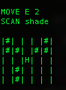
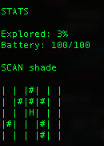

# Projects with Python

This file contains code I wrote in Python

1. Algorithms

This folder contains classification algorithms such as KNN, Bayesian and search algorithms like BFS or DFS

2. Computational Modelling

This Jupyter Notebook simulate two scenarios:

* A zombie apocalypse that simulate the spread of virus between people in contact
* The average wait time of a bus for passengers at bus stations

3. Rover

This is my first game in Python, written in my first semester of university. It is a game run in terminal, where you are supposed to navigate a rover to a given destination.

4. Vehicle

This is a data analysis project where we observed the the cause and circumstances of vehicle accidents in the US and Australia. The project was done in Excel and Python where we cleaned the dataset analysed them separately and also compared the two nations. For more information, read the reports of the analysis.