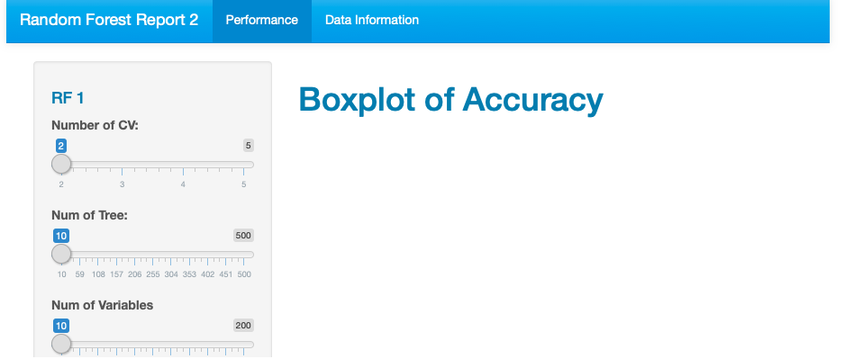
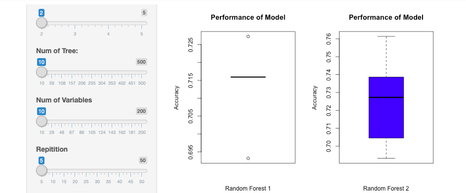
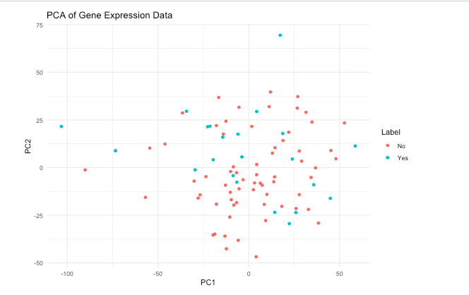
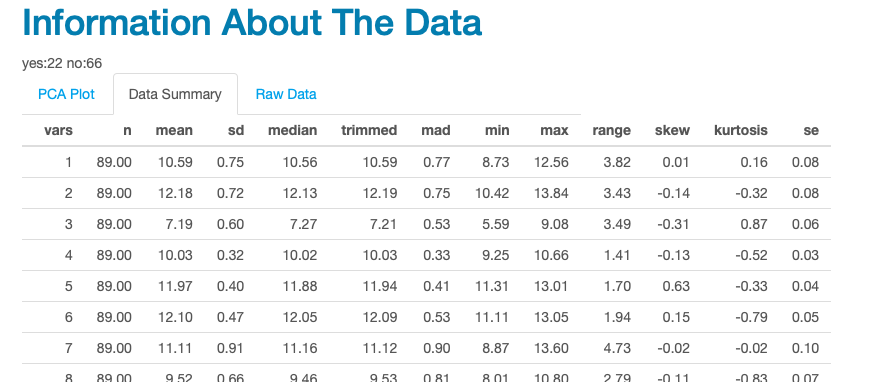

# ShinyApp

Before downloading the App, make sure to install the following packages to RStudio:

* GEOquery
* R.utils
* reshape2
* ggplot2
* limma
* dplyr
* randomForest
* cvTools
* shiny
* shinythemes
* DT
* tidyverse
* doParallel
* bigstatsr

Make sure, the GSE120396_expression_matrix.csv is in the same path as the App.

The app is made of 4 files: ui.R, Tab.R, server.R and global.R

## Images

